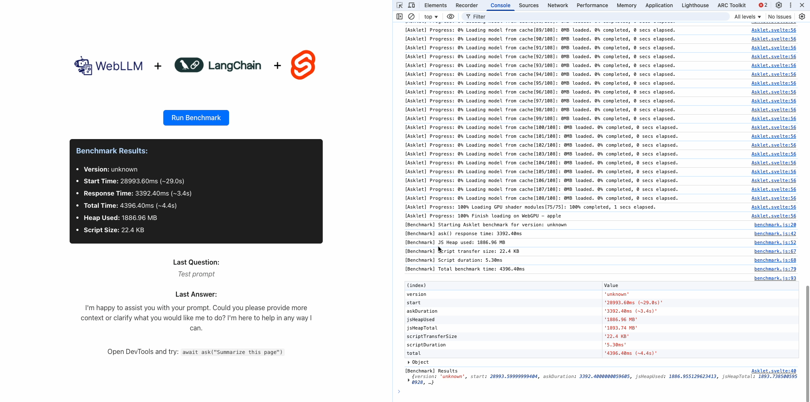

## 🌐 Asklet
### In-Browser LLM Benchmarking with WebLLM + LangChain

Asklet is an open benchmarking sandbox for testing local LLM inference performance across modern frontend frameworks like React, Svelte, and Qwik — using WebLLM and LangChain.js.

🔍 What it does:
- Runs LLMs entirely in the browser — no server or API calls.
- Injects a DevTools-callable ask() function for experiments.
- Captures detailed token-level performance metrics:
  - Time to First Token (TTFT)
  - Time per Output Token (TPOT)
  - Total generation time
  - Token throughput
  - JS heap usage
  - Script transfer size

🛠️ What it uses:
- **React Demo**: Utilizes the React framework to demonstrate how LLMs can be integrated and benchmarked within a React application, focusing on component-based architecture. [View React Demo](https://github.com/hwclass/asklet/tree/main/demo/react)
- **Svelte Demo**: Leverages Svelte's reactivity and compile-time optimizations to showcase LLM performance in a Svelte environment. [View Svelte Demo](https://github.com/hwclass/asklet/tree/main/demo/svelte)
- **Qwik Demo**: Explores the use of Qwik for LLM benchmarking, highlighting its lazy-loading capabilities and how it affects inference performance. [View Qwik Demo](https://github.com/hwclass/asklet/tree/main/demo/qwik)
- **Web Components**: Demonstrates the use of Web Components for LLM integration, providing a framework-agnostic approach to embedding LLMs in any web application. [View Web Components Demo](https://github.com/hwclass/asklet/tree/main/demo/web-components)

🧪 Why it matters:
This repo helps answer:

_“How efficient is local inference for real-world prompts across frameworks?”_

Great for evaluating performance trade-offs when embedding LLMs natively into your apps, extensions, or UIs.

📦 Includes:
  - Minimal demo apps for React, Svelte, Qwik
  - Shared benchmarking logic and metric collector
  - Sample prompts and usage guide

## License

This project is licensed under the MIT License. See the [LICENSE](LICENSE) file for details.

Copyright (c) 2025
MIT License